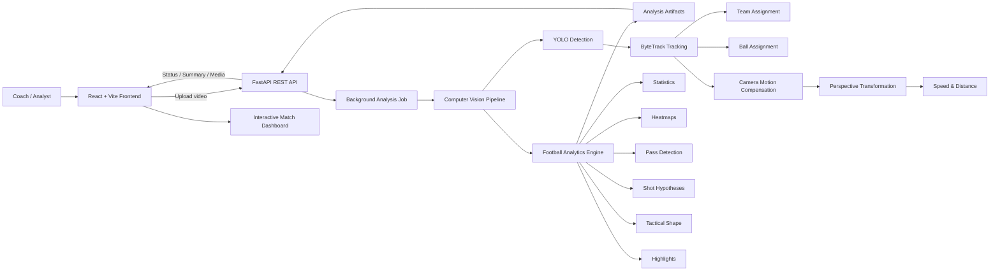
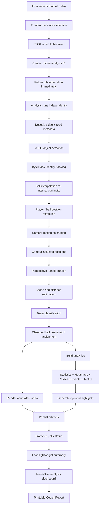
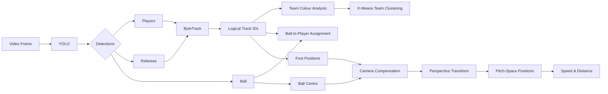
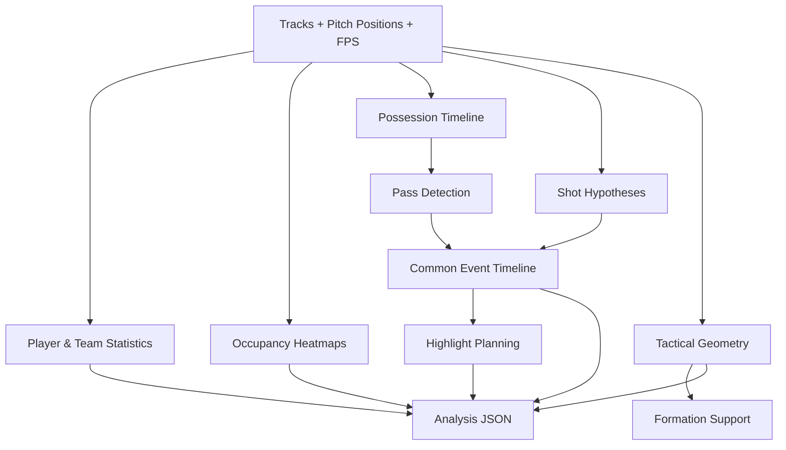
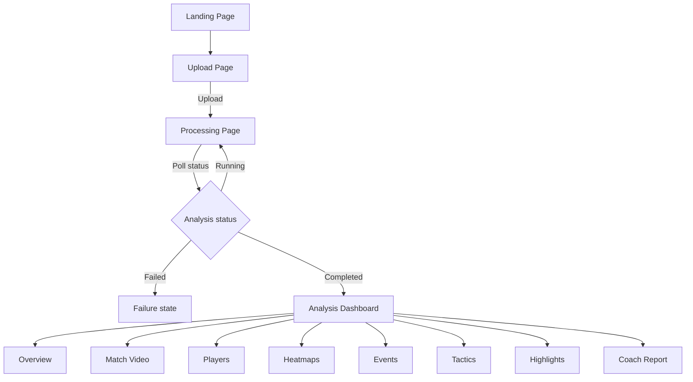
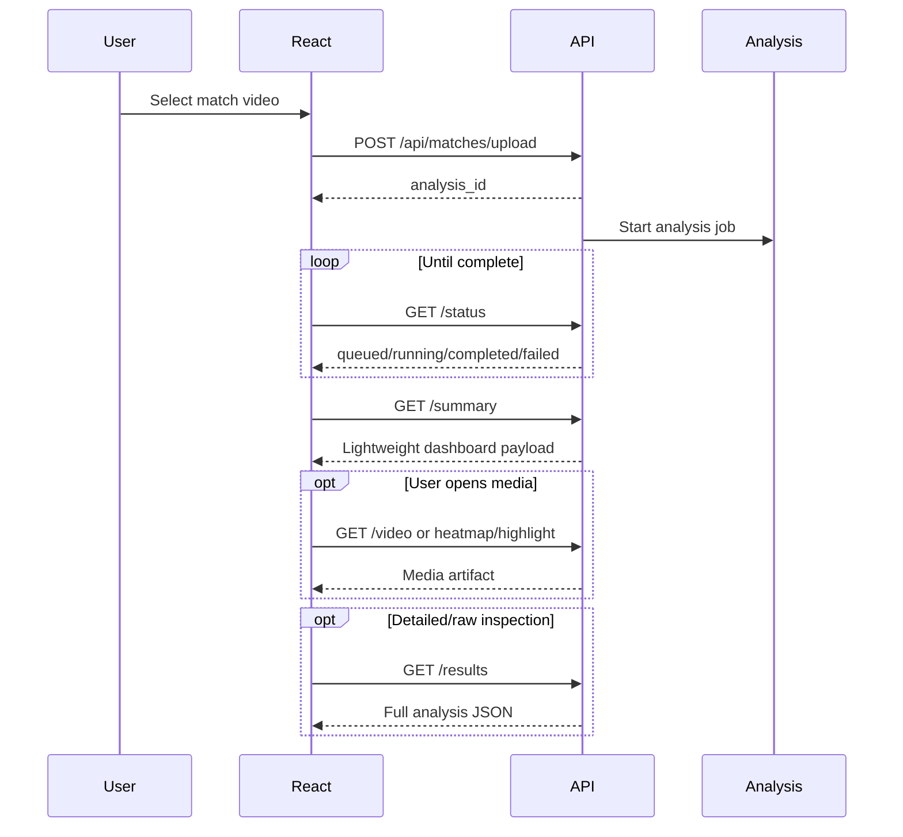

# MatchVision

> **Video-Based Football Match Analytics for Teams**\
> Turn ordinary match footage into structured, explainable performance
> and tactical observations.

```{=html}
<p align="center">
```
`<strong>`{=html}Computer Vision • Player Tracking • Team Classification
• Ball Possession • Heatmaps • Passing • Tactical Shape • Highlights •
Coach Reports`</strong>`{=html}
```{=html}
</p>
```

------------------------------------------------------------------------

## Table of Contents

1.  [Overview](#overview)
2.  [Problem Statement](#problem-statement)
3.  [Our Solution](#our-solution)
4.  [Core Objectives](#core-objectives)
5.  [Key Features](#key-features)
6.  [System Architecture](#system-architecture)
7.  [End-to-End Workflow](#end-to-end-workflow)
8.  [Computer Vision Pipeline](#computer-vision-pipeline)
9.  [Analytics Pipeline](#analytics-pipeline)
10. [Frontend Workflow](#frontend-workflow)
11. [Technology Stack](#technology-stack)
12. [Project Structure](#project-structure)
13. [How the Major Modules Work](#how-the-major-modules-work)
14. [Analytics and Metrics](#analytics-and-metrics)
15. [API Design](#api-design)
16. [Installation](#installation)
17. [Running MatchVision](#running-matchvision)
18. [Configuration](#configuration)
19. [Input and Output](#input-and-output)
20. [Hardware and Software
    Requirements](#hardware-and-software-requirements)
21. [Testing](#testing)
22. [Design Principles](#design-principles)
23. [Known Limitations](#known-limitations)
24. [Future Scope](#future-scope)
25. [Why MatchVision Matters](#why-matchvision-matters)
26. [Repository](#repository)

------------------------------------------------------------------------


## Hackathon / Challenge Information

| Field | Details |
|---|---|
| **Problem Statement** | **SP-05 — MatchVision: Video-Based Match Analytics for Teams** |
| **Project Name** | **MatchVision** |
| **Team Name** | **4 LOOPS** |
| **Domain** | AI/ML • Computer Vision • Sports Analytics |
| **Primary Goal** | Convert ordinary football match footage into structured player, team, event and tactical analytics that can support coaches and analysts. |

## Team 4 LOOPS

MatchVision is developed by **Team 4 LOOPS**, a four-member team working on SP-05.

| Team Member |
|---|
| **Arpan Biswas** |
| **Ayan Kumar Mondal** |
| **Aritra Pal** |
| **Aritra Adak** |

Our approach combines computer vision, multi-object tracking, football-specific analytics and a coach-friendly web interface to make advanced match analysis more accessible to teams that may not have dedicated tracking hardware or expensive commercial analytics systems.


## Overview

**MatchVision** is an AI-powered football video analytics platform that
converts match footage into structured observations about player
movement, team behaviour, ball control, passing, spatial occupancy,
speed, distance, tactical shape, events and highlights.

The project combines **computer vision**, **multi-object tracking**,
**football-specific analytics**, and a modern web interface so that a
coach or analyst can upload footage and receive an interactive analysis
instead of manually reviewing the entire recording.

The platform is designed around one important principle:

> **Only report what the available video evidence supports.**

MatchVision therefore distinguishes between a genuine measured value of
`0` and an **Unavailable** metric caused by insufficient visual
evidence. Formation estimates describe visible spatial shape rather than
claiming tactical intent, and tracking identities are treated as logical
video identities rather than guaranteed real-world player identities.

------------------------------------------------------------------------

## Problem Statement

Traditional football analysis can require dedicated tracking hardware,
multiple cameras, expensive commercial platforms, or significant manual
annotation. This makes advanced match analysis difficult for grassroots
clubs, academies, college teams and smaller coaching staffs.

Raw match footage contains valuable information, but extracting it
manually is slow. Coaches may want answers such as:

-   Which team controlled more of the observed possession?
-   Which players covered the greatest measured distance?
-   Where did each team spend most of its time?
-   Which player sent or received a detected pass?
-   How wide or compact was a team?
-   What important events occurred?
-   Which moments should be reviewed again?

MatchVision addresses this by creating an automated pipeline from
**video → detections → tracking → calibrated positions → analytics →
visual report**.

------------------------------------------------------------------------

## Our Solution

MatchVision accepts football footage, analyses it frame by frame and
produces an interactive dashboard containing:

-   annotated match video;
-   player and ball tracking;
-   automatic team assignment;
-   possession estimates;
-   speed and distance observations;
-   team/player/ball heatmaps;
-   detected pass relationships;
-   probable event observations;
-   tactical shape metrics;
-   highlight clips;
-   a printable coach report.

The system consists of three logical layers:

1.  **Computer Vision Layer** -- detects and tracks objects in the
    footage.
2.  **Analytics Layer** -- converts tracks into football-specific
    measurements.
3.  **Presentation Layer** -- exposes results through APIs and a React
    dashboard.

------------------------------------------------------------------------

## Core Objectives

MatchVision was built to:

-   make video-based football analytics accessible without specialist
    tracking hardware;
-   automate repetitive match-review work;
-   provide visual and numerical observations in one workspace;
-   keep analytics explainable and evidence-based;
-   support GPU acceleration while retaining CPU fallback;
-   separate heavy analysis from the responsive web interface;
-   present technical results in a coach-friendly format.

------------------------------------------------------------------------

# Key Features

## 1. Player, Referee and Ball Detection

A custom YOLO model is used to detect football-related objects from
video frames. Goalkeepers are normalized into the player class for
downstream player tracking.

## 2. Multi-Object Tracking

Detected players are associated across frames using **ByteTrack**. Each
tracked object receives a logical tracking ID that can be used for
movement, distance, team assignment and analytics.

## 3. Team Assignment

Player jersey appearance is sampled from the upper region of each
detected player. K-Means clustering is used to estimate representative
player colours and separate tracked players into two visual teams.

## 4. Ball-to-Player Assignment

When the ball is observed, MatchVision compares the ball position with
player bounding boxes and assigns possession to a nearby player when the
distance satisfies the configured threshold.

## 5. Team Ball Control

Player-level possession observations are aggregated into Team 1 and Team
2 ball-control estimates over supported frames.

## 6. Camera Movement Compensation

Optical flow is used to estimate camera movement between frames. This
helps distinguish apparent movement caused by camera panning from
movement on the field.

## 7. Perspective Transformation

Image-space positions are transformed into a calibrated pitch-space
region. This enables football measurements to be expressed in
field-relative coordinates rather than raw pixels.

## 8. Speed and Distance Estimation

Transformed player positions are used to estimate movement, cumulative
distance and speed. These values depend on the quality and relevance of
pitch calibration.

## 9. Heatmaps

MatchVision builds occupancy histograms for:

-   teams;
-   individual players;
-   observed ball locations.

The heatmap subsystem records both sample counts and occupancy time.
Ball heatmaps use observed ball detections rather than silently treating
interpolated locations as confirmed observations.

## 10. Pass Analysis

The analytics layer analyses possession transitions and supporting
movement evidence to infer pass hypotheses. Detected passes can be
connected to sender and receiver identities and used to construct
passing relationships.

## 11. Event Detection

A common event timeline is used to represent qualifying match
observations such as passes and probable shot events. Shot detection is
intentionally conservative and can depend on validated goal calibration.

## 12. Tactical Shape Analysis

For sufficiently covered periods, MatchVision measures:

-   team width;
-   team depth;
-   compactness;
-   centroid;
-   visible-player coverage;
-   supported formation hypotheses.

These describe the geometry of visible players, **not confirmed tactical
intent**.

## 13. Highlight Generation

Detected events can be converted into reviewable highlight clips.
Highlight generation is optional so that an encoding failure does not
invalidate the main computer-vision analysis.

## 14. Coach Report

The dashboard provides a printable match report summarizing possession,
movement, team shape, events, player performance and important analysis
notes.

------------------------------------------------------------------------


# Feature Set at a Glance

| Feature | What MatchVision Provides |
|---|---|
| **Match Video Upload** | Upload football footage through a clean web interface and create an isolated analysis job. |
| **2+ Minute Video Analysis Workflow** | Designed for match clips beyond short demos, with processing separated from the responsive frontend. |
| **Player Detection** | Detects visible football players using a YOLO-based computer-vision model. |
| **Referee Detection** | Separately tracks referee observations where detected. |
| **Ball Detection** | Detects the football and preserves observed-ball provenance for downstream analytics. |
| **Multi-Object Player Tracking** | Uses ByteTrack to maintain logical player identities across frames. |
| **Automatic Team Classification** | Uses jersey-colour analysis and K-Means clustering to separate players into two teams. |
| **Ball-to-Player Assignment** | Associates an observed ball with the closest eligible tracked player. |
| **Team Possession Analysis** | Estimates Team 1 vs Team 2 ball control from supported possession observations. |
| **Player Possession Analysis** | Measures supported possession frames/time for individual tracked players. |
| **Camera Movement Compensation** | Uses optical flow to reduce the effect of camera panning on spatial measurements. |
| **Perspective Transformation** | Converts calibrated image-space positions into pitch-space coordinates. |
| **Speed Estimation** | Estimates player speed from transformed movement where calibration supports it. |
| **Distance Estimation** | Estimates cumulative player movement distance. |
| **Team Heatmaps** | Visualizes the areas occupied most frequently by each team. |
| **Player Heatmaps** | Generates movement/occupancy heatmaps for individual tracked players. |
| **Ball Heatmap** | Visualizes supported observed ball locations. |
| **Football-Pitch Heatmap Presentation** | Heatmap data is designed to be presented in a football-field context for intuitive interpretation. |
| **Pass Detection** | Infers supported pass events from possession transitions and tracking evidence. |
| **Pass Sender / Receiver Analytics** | Associates detected pass events with logical sender and receiver identities when evidence permits. |
| **Shot Hypotheses** | Supports conservative probable-shot observations, optionally using validated goal calibration. |
| **Event Timeline** | Combines supported match events into a structured timeline for review. |
| **Tactical Width** | Measures the lateral spread of visible team players. |
| **Tactical Depth** | Measures the longitudinal spread of visible team players. |
| **Team Compactness** | Estimates how tightly the visible team unit is grouped around its centroid. |
| **Team Centroid** | Tracks the average spatial position of visible team players. |
| **Formation Support** | Produces conservative formation/shape hypotheses when enough player coverage exists. |
| **Annotated Match Video** | Produces processed video with tracking IDs, team indicators, ball markers and analysis overlays. |
| **Automatic Highlights** | Can create reviewable highlight clips from supported detected events. |
| **Interactive Analysis Dashboard** | Presents overview, players, heatmaps, events, tactics and highlights through React. |
| **Processing Status Screen** | Keeps the UI responsive while heavy analysis runs independently. |
| **Coach Report** | Provides a coach-oriented summary suitable for review and printing. |
| **Full Analysis JSON** | Preserves structured machine-readable output for deeper analysis or future integrations. |
| **Evidence-Aware Metrics** | Distinguishes genuine zero values from metrics that are unavailable because evidence is insufficient. |
| **Failure Diagnostics** | Records the stage and reason when a core analysis run fails. |
| **CPU/GPU Support** | Can use CUDA-capable PyTorch environments for faster model inference, with CPU operation where supported. |


# System Architecture



### Architectural Responsibilities

  -----------------------------------------------------------------------
  Layer                               Responsibility
  ----------------------------------- -----------------------------------
  Frontend                            Upload, progress, visual
                                      exploration and report presentation

  API                                 Accept requests, expose
                                      status/results/media and isolate
                                      frontend from heavy processing

  Analysis Orchestrator               Coordinates the complete
                                      computer-vision workflow

  Detection & Tracking                Converts video frames into object
                                      tracks

  Spatial Processing                  Camera compensation and
                                      pitch-coordinate transformation

  Analytics                           Produces statistics, events,
                                      heatmaps and tactical observations

  Artifact Layer                      Stores annotated video, JSON
                                      results, heatmaps and highlights
  -----------------------------------------------------------------------

------------------------------------------------------------------------

# End-to-End Workflow



------------------------------------------------------------------------

# Computer Vision Pipeline



### Why logical identities?

Tracking IDs represent identities maintained by the tracker inside the
video. Occlusion, missed detections and difficult camera movement can
fragment or switch an identity. MatchVision therefore avoids presenting
tracker IDs as guaranteed unique real-world people.

------------------------------------------------------------------------

# Analytics Pipeline



------------------------------------------------------------------------

# Frontend Workflow



The frontend intentionally requests a **lightweight summary** for normal
dashboard use. The complete analysis JSON remains available separately
because full tracking/analytics payloads can become large.

------------------------------------------------------------------------

# Technology Stack

## Artificial Intelligence / Computer Vision

  Technology                  Purpose
  --------------------------- ---------------------------------------------------------
  Python                      Core analysis language
  Ultralytics YOLO            Player/referee/ball object detection
  ByteTrack via Supervision   Multi-object tracking
  OpenCV                      Video I/O, drawing and optical flow
  NumPy                       Numerical processing
  Pandas                      Ball-position interpolation and structured calculations
  scikit-learn                K-Means colour/team clustering
  PyTorch / CUDA              GPU-backed model inference where available

## Analytics

  -----------------------------------------------------------------------
  Component                           Purpose
  ----------------------------------- -----------------------------------
  Perspective transformation          Convert image coordinates to
                                      calibrated pitch coordinates

  Optical flow                        Camera movement estimation

  Occupancy histograms                Player/team/ball heatmaps

  Event heuristics                    Pass and shot observations

  Spatial geometry                    Width, depth, centroid and
                                      compactness

  Formation analysis                  Conservative supported shape
                                      estimation
  -----------------------------------------------------------------------

## Backend / API

  Technology         Purpose
  ------------------ ---------------------------------------
  FastAPI            REST API
  Uvicorn            ASGI development server
  Python Multipart   Video/form upload handling
  JSON artifacts     Persistent structured analysis output

## Frontend

  Technology     Purpose
  -------------- --------------------------------------
  React 19       User interface
  React Router   Client-side routing
  Vite 6         Development server and build tooling
  CSS            Responsive MatchVision visual system
  Fetch API      Backend communication

------------------------------------------------------------------------

# Project Structure

``` text
MatchVision-Codevoyage/
│
├── main.py
│   └── Command-line entry point for football analysis
│
├── legacy_main.py
│   └── Earlier project entry point retained for reference
│
├── model/
│   └── best.pt
│       └── Custom YOLO model weights
│
├── matchvision/
│   ├── analysis.py
│   │   └── Main analysis orchestrator
│   ├── results.py
│   │   └── Builds structured result payload
│   ├── analytics/
│   │   ├── statistics.py
│   │   ├── events.py
│   │   ├── pass_detection.py
│   │   ├── shot_detection.py
│   │   ├── tactics.py
│   │   ├── formation.py
│   │   └── heatmaps.py
│   ├── highlights/
│   │   ├── planning.py
│   │   ├── service.py
│   │   ├── video.py
│   │   └── paths.py
│   ├── pass_cli.py
│   ├── highlight_cli.py
│   └── highlight_options.py
│
├── trackers/
│   └── tracker.py
│       └── YOLO inference, ByteTrack and visual annotations
│
├── team_assigner/
│   └── team_assigner.py
│       └── Jersey colour extraction + K-Means team classification
│
├── player_ball_assigner/
│   └── player_ball_assigner.py
│       └── Ball-to-player proximity assignment
│
├── camera_movement_estimator/
│   └── camera_movement_estimator.py
│       └── Optical-flow camera motion estimation
│
├── view_transformer/
│   └── view_transformer.py
│       └── Perspective transformation
│
├── speed_and_distance_estimator/
│   └── speed_and_distance_estimator.py
│       └── Movement-derived metrics
│
├── util/
│   └── video_utils.py
│       └── Video reading/writing helpers
│
├── frontend/
│   ├── package.json
│   ├── vite.config.js
│   └── src/
│       ├── App.jsx
│       ├── api/
│       │   └── matchvision.js
│       ├── pages/
│       │   ├── Landing.jsx
│       │   ├── Upload.jsx
│       │   ├── Processing.jsx
│       │   └── Analysis.jsx
│       ├── components/
│       │   ├── Overview.jsx
│       │   ├── Players.jsx
│       │   ├── Tactics.jsx
│       │   └── ...
│       └── styles/
│           └── app.css
│
├── tests/
│   ├── test_analysis.py
│   ├── test_analytics.py
│   ├── test_pass_detection.py
│   ├── test_shot_detection.py
│   ├── test_tactics.py
│   └── test_highlights.py
│
├── input_video/
└── stubs/
```

------------------------------------------------------------------------

# How the Major Modules Work

## `matchvision/analysis.py`

This is the central orchestration layer. A single analysis run receives
a source video and coordinates:

1.  input/model validation;
2.  video decoding;
3.  YOLO detection;
4.  ByteTrack tracking;
5.  ball interpolation for continuity;
6.  position extraction;
7.  camera movement estimation;
8.  camera-adjusted coordinates;
9.  perspective transformation;
10. speed and distance;
11. team assignment;
12. possession;
13. annotated video;
14. analytics;
15. result persistence;
16. optional highlight generation.

Each run receives a unique UUID-based analysis ID so artifacts from
different analyses remain isolated.

## `trackers/tracker.py`

The tracker:

-   loads the YOLO model;
-   performs batched detection;
-   maps goalkeeper detections into the player class;
-   feeds compatible detections into ByteTrack;
-   records players, referees and ball observations;
-   interpolates ball bounding boxes for internal continuity;
-   adds player foot positions and ball centre positions;
-   renders tracking annotations.

## `team_assigner/team_assigner.py`

The team assigner:

1.  crops the upper half of a detected player;
2.  clusters crop pixels to separate likely jersey and background
    colours;
3.  obtains a representative player colour;
4.  uses a second K-Means model to separate player colours into two
    teams;
5.  caches player-to-team assignments.

## `player_ball_assigner/player_ball_assigner.py`

Ball possession is estimated by comparing the observed ball centre to
the lower-left/lower-right region of player boxes. The closest eligible
player inside the configured threshold receives the ball assignment.

## `camera_movement_estimator`

OpenCV feature tracking and Lucas--Kanade optical flow estimate
inter-frame camera displacement. The displacement is applied to tracked
positions before field-space analytics.

## `view_transformer`

A perspective transformation maps calibrated source-image points to
target field coordinates. This is essential because pixel distance is
not directly equivalent to physical distance.

## `speed_and_distance_estimator`

Player displacement in transformed coordinates is converted into
estimated speed and cumulative distance. Results should be interpreted
as calibration-dependent estimates.

------------------------------------------------------------------------

# Analytics and Metrics

## Possession

Team possession is based on frames in which ball/player evidence
supports an assignment. The system can carry the previous known team for
team-control continuity, while player-level possession is more
conservative and uses supported ball-assignment frames.

``` text
Player possession time = supported possession frames / source FPS
```

Team percentages are calculated over known team-control frames.

## Distance

For each logical player identity, MatchVision uses the maximum available
cumulative distance measurement rather than summing repeated cumulative
readings.

## Speed

Player speed summaries use valid per-frame estimates.

``` text
Player average speed = mean(valid speed estimates)
Player maximum speed = max(valid speed estimates)
```

## Tracked Time

``` text
Tracked time = observed player frames / source FPS
```

This does not pretend that gaps between detections were continuously
observed.

## Heatmaps

Pitch-space samples are binned into a two-dimensional occupancy grid.

``` text
Occupancy seconds per cell = sample count / FPS
```

Team heatmaps represent player-sample occupancy and therefore behave
like **player-seconds**, while the ball heatmap is restricted to
supported observed ball positions.

## Team Width

Lateral spread of visible team players in transformed coordinates.

## Team Depth

Longitudinal spread of visible team players.

## Compactness

Mean spatial distance of visible players from the team centroid. Lower
values represent a more tightly grouped visible unit.

## Centroid

The mean transformed position of the visible team players.

## Formation

Formation output is a hypothesis supported by visible-player geometry.
MatchVision deliberately returns insufficient/unknown states when the
video does not provide enough stable coverage.

## Passes

Pass detection uses the shared event-analysis pipeline. A valid detected
pass can contain sender, receiver, team and timing information when
supported by tracking and possession evidence.

## Shots

Shot observations are **probable events**, not confirmed goals.
Goal-region calibration can be supplied when reliable shot analysis is
required.

------------------------------------------------------------------------

# API Design

The frontend API client is configured around:

``` text
http://127.0.0.1:8000
```

unless `VITE_API_BASE_URL` is supplied.

### Core Endpoints

  ---------------------------------------------------------------------------------------
  Method                  Endpoint                                Purpose
  ----------------------- --------------------------------------- -----------------------
  `POST`                  `/api/matches/upload`                   Upload footage and
                                                                  create analysis

  `GET`                   `/api/matches/{id}/status`              Poll processing status

  `GET`                   `/api/matches/{id}/summary`             Load lightweight
                                                                  dashboard data

  `GET`                   `/api/matches/{id}/results`             Load complete analysis
                                                                  payload

  `GET`                   `/api/matches/{id}/video`               Stream/download
                                                                  analysed video

  `GET`                   `/api/matches/{id}/heatmaps/{name}`     Retrieve generated
                                                                  heatmap

  `GET`                   `/api/matches/{id}/highlights/{name}`   Retrieve highlight
                                                                  media
  ---------------------------------------------------------------------------------------

### Frontend API Flow



------------------------------------------------------------------------

# Installation

## Prerequisites

Install:

-   **Git**
-   **Git LFS** -- recommended because model/video assets may be stored
    using LFS
-   **Python 3.11**
-   **Node.js 22.12+**
-   **npm**
-   **FFmpeg** -- recommended for media conversion/highlight workflows
-   Optional: NVIDIA driver + CUDA-compatible PyTorch build for GPU
    inference

## 1. Clone the Repository

``` powershell
git clone https://github.com/arpbiswas04-coder/MatchVision-Codevoyage.git
cd MatchVision-Codevoyage
```

If Git LFS is installed:

``` powershell
git lfs install
git lfs pull
```

Verify that `model/best.pt` contains the actual model binary and not an
unresolved Git LFS pointer.

## 2. Create a Python Virtual Environment

### Windows PowerShell

``` powershell
py -3.11 -m venv .venv
.\.venv\Scripts\Activate.ps1
python -m pip install --upgrade pip
```

If PowerShell blocks activation for the current shell:

``` powershell
Set-ExecutionPolicy -Scope Process -ExecutionPolicy Bypass
.\.venv\Scripts\Activate.ps1
```

## 3. Install Python Dependencies

If the repository contains a generated dependency file in your current
branch, prefer:

``` powershell
pip install -r requirements.txt
```

The project requires packages from the following groups:

``` text
ultralytics
supervision
opencv-python
numpy
pandas
scikit-learn
fastapi
uvicorn
python-multipart
```

The analytics/highlight implementation may additionally require packages
used by the current branch for plotting, encoding or testing.

### CUDA / PyTorch

For GPU inference, install a PyTorch build compatible with your NVIDIA
driver/CUDA environment. Verify with:

``` powershell
python -c "import torch; print(torch.__version__); print('CUDA:', torch.cuda.is_available()); print(torch.cuda.get_device_name(0) if torch.cuda.is_available() else 'CPU')"
```

MatchVision should still be able to operate with CPU inference where
supported, but GPU inference is strongly recommended for match footage.

## 4. Install Frontend Dependencies

Open another terminal:

``` powershell
cd frontend
npm install
```

The current frontend declares **Node.js \>= 22.12.0**.

------------------------------------------------------------------------

# Running MatchVision

## CLI Analysis

The repository includes a command-line analysis entry point:

``` powershell
python main.py "input_video\your_match.mp4"
```

Optional output directory:

``` powershell
python main.py "input_video\your_match.mp4" --output-directory outputs
```

Optional shot calibration:

``` powershell
python main.py "input_video\your_match.mp4" --shot-calibration "path\to\calibration.json"
```

## Web Application

### Backend

Start the FastAPI application using the ASGI module present in the
web-enabled branch of the project, for example:

``` powershell
uvicorn <api_module>:app --host 127.0.0.1 --port 8000 --reload
```

> **Repository note:** the current checked-in `main.py` is the CLI entry
> point, while the React client already targets the FastAPI
> `/api/matches/...` contract. If the API server file is maintained
> locally or on another branch, replace `<api_module>` with that module
> path before judging. The API server source should be committed
> together with its dependency file for a fully reproducible submission.

### Frontend

``` powershell
cd frontend
npm run dev
```

Open:

``` text
http://127.0.0.1:5173
```

Vite is configured to use port **5173**.

------------------------------------------------------------------------

# Configuration

## Frontend API Base URL

Create `frontend/.env` when the backend is not running at the default
address:

``` env
VITE_API_BASE_URL=http://127.0.0.1:8000
```

The frontend automatically removes trailing slashes.

## Model

Default model location:

``` text
model/best.pt
```

The analysis orchestrator validates that the model exists before
processing.

## Pitch Calibration

Speed, distance, heatmaps and tactical geometry depend on the
perspective calibration in the view-transformer layer.

For footage from a substantially different camera angle, the calibration
should be updated before treating metric distances as reliable physical
measurements.

## Shot Calibration

Shot detection can accept input-specific goal calibration. Without
validated goal geometry, MatchVision should remain conservative instead
of presenting uncertain shot/goal claims as fact.

------------------------------------------------------------------------

# Input and Output

## Supported Input

MatchVision is designed for ordinary football match video footage. Best
results are expected when:

-   players are clearly visible;
-   the ball is visible often enough;
-   the camera is reasonably stable;
-   resolution is sufficient for detection;
-   the pitch view resembles the calibration setup;
-   severe compression and motion blur are limited.

## Per-Analysis Output

A unique analysis directory is created for each run.

Typical artifacts include:

``` text
outputs/
└── <analysis_id>/
    ├── output_video.avi
    ├── analysis.json
    ├── heatmaps/
    │   ├── team_1.png
    │   ├── team_2.png
    │   ├── player_<id>.png
    │   └── ball.png
    ├── highlights/
    │   └── ...
    └── failure.json     # written when a core analysis stage fails
```

The exact optional artifact set depends on available evidence and
enabled analysis stages.

------------------------------------------------------------------------

# Hardware and Software Requirements

## Minimum Development Setup

  -----------------------------------------------------------------------
  Component                           Recommendation
  ----------------------------------- -----------------------------------
  OS                                  Windows 10/11, Linux or compatible
                                      development environment

  Python                              3.11 recommended

  Node.js                             22.12+

  RAM                                 8 GB minimum; 16 GB recommended

  Storage                             Several GB free for environments,
                                      model and generated video

  GPU                                 Optional

  Browser                             Current Chrome/Edge/Firefox
  -----------------------------------------------------------------------

## Recommended AI Setup

  Component   Recommendation
  ----------- --------------------------------------------------
  RAM         16 GB+
  GPU         NVIDIA CUDA-capable GPU
  VRAM        \~6 GB or more recommended for local development
  Storage     SSD
  FFmpeg      Installed and available on PATH

The project has been developed with an **NVIDIA RTX 4050 Laptop GPU**
class environment in mind. Actual processing speed depends on video
resolution, FPS, duration, model size and selected analytics.

------------------------------------------------------------------------

# Testing

The repository contains automated tests for major analytics components:

``` text
tests/test_analysis.py
tests/test_analytics.py
tests/test_pass_detection.py
tests/test_shot_detection.py
tests/test_tactics.py
tests/test_highlights.py
```

To run the test suite after installing development dependencies:

``` powershell
pytest
```

## Recommended Manual Validation

### Short Smoke Test

Use a 20--30 second clip and verify:

-   upload succeeds;
-   processing status changes correctly;
-   analysis completes;
-   annotated video loads;
-   players appear;
-   heatmaps load;
-   tactics page does not crash;
-   coach report prints.

### Required Long-Clip Validation

Use a **2+ minute** real match clip and verify:

-   upload is accepted;
-   backend continues processing;
-   progress/status polling remains responsive;
-   GPU memory remains stable enough to complete;
-   summary endpoint loads without transferring the entire full result;
-   video and heatmaps load independently;
-   optional highlight failure does not invalidate the completed core
    analysis.

------------------------------------------------------------------------

# Design Principles

## 1. Evidence Before Claims

MatchVision avoids inventing metrics when the video cannot support them.

``` text
0           = the metric was evaluated and the measured result is zero
Unavailable = the metric could not be supported by available evidence
```

## 2. Calibration Transparency

Metric field measurements depend on camera calibration. The application
exposes limitations rather than hiding them.

## 3. Conservative Tactical Interpretation

Width, depth, centroid and compactness are geometric measurements of
visible players. They do not prove a coach's tactical intention.

## 4. Conservative Event Interpretation

Probable shot detection is not equivalent to confirmed goal recognition.

## 5. Identity Transparency

Tracking IDs may fragment or switch under difficult conditions. They are
logical analysis identities.

## 6. Optional Features Must Not Break Core Analysis

Highlight/media export is treated as optional. Failure in an optional
encoding stage should not invalidate already-computed analytics.

## 7. Lightweight Web Experience

The normal dashboard uses a summary endpoint while the full result
remains available for detailed inspection.

------------------------------------------------------------------------

# Known Limitations

MatchVision is a video-analysis system and therefore depends on the
information visible in the source footage.

Current limitations include:

-   player tracking may fragment during occlusion;
-   ball detection can be difficult because the football occupies few
    pixels;
-   team classification depends on visible jersey colour differences;
-   speed and distance accuracy depends on perspective calibration;
-   fixed calibration may not generalize to every camera;
-   a single broadcast-style camera does not observe every player at
    every moment;
-   pass detection depends on reliable possession/ball evidence;
-   formation analysis requires enough simultaneously visible players;
-   shot analysis is stronger with validated goal-region calibration;
-   a short clip may not contain enough evidence for meaningful tactical
    conclusions.

These limitations are deliberately surfaced in the product instead of
being silently converted into false certainty.

------------------------------------------------------------------------

# Future Scope

Potential extensions include:

-   automatic pitch-line calibration;
-   homography estimation from detected field markings;
-   improved re-identification to reduce track fragmentation;
-   jersey-number recognition;
-   player-name mapping from squad sheets;
-   stronger small-ball detection;
-   multi-camera fusion;
-   xG and shot-quality models;
-   progressive-pass and line-breaking-pass analysis;
-   defensive pressure metrics;
-   passing networks and network centrality;
-   possession chains;
-   attacking-third and final-third analytics;
-   automatic phase-of-play segmentation;
-   goalkeeper-specific analytics;
-   cloud job queues and persistent analysis history;
-   authentication and team workspaces;
-   comparison across multiple matches;
-   season-level player dashboards;
-   downloadable PDF reports.

------------------------------------------------------------------------

# Why MatchVision Matters

MatchVision is not simply an object-detection demo.

It creates a complete analysis chain:

``` text
Football Video
      ↓
Object Detection
      ↓
Multi-Object Tracking
      ↓
Team + Ball Understanding
      ↓
Camera Compensation
      ↓
Pitch-Space Transformation
      ↓
Movement + Possession
      ↓
Events + Heatmaps + Tactical Geometry
      ↓
Interactive Dashboard
      ↓
Coach-Friendly Report
```

The value of the project lies in connecting computer vision with
football-specific interpretation while preserving uncertainty and making
the result understandable to a human user.

The same footage that previously required manual review can become a
structured collection of observations, visualizations and reviewable
moments.

------------------------------------------------------------------------

# Repository

Project repository:

**MatchVision-Codevoyage**\
`arpbiswas04-coder/MatchVision-Codevoyage`

------------------------------------------------------------------------

## Final Note

MatchVision is built around a simple idea:

> **Every movement can become a better understanding of the game.**

The system is intended to assist coaches and analysts by organizing
observable match evidence---not to replace human tactical judgment.
